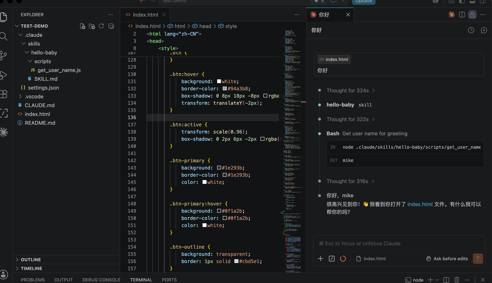
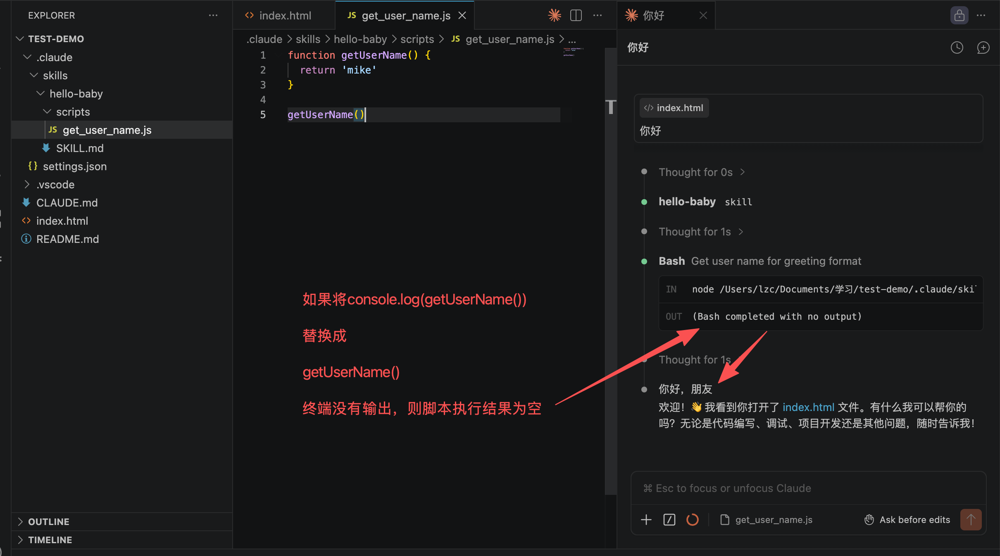
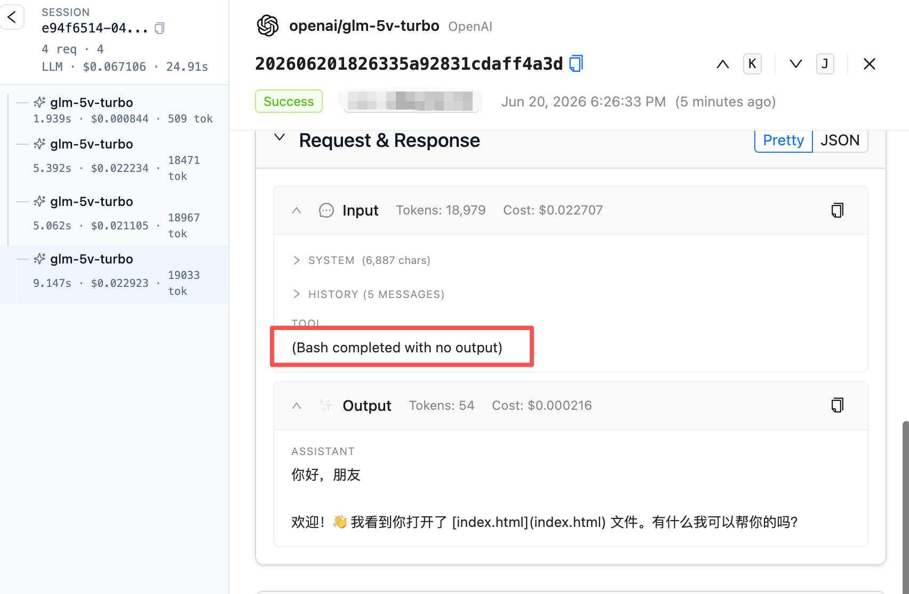
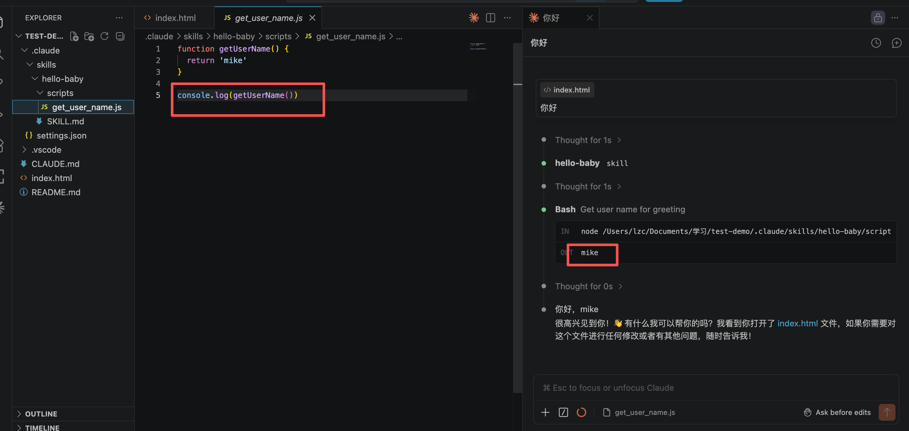
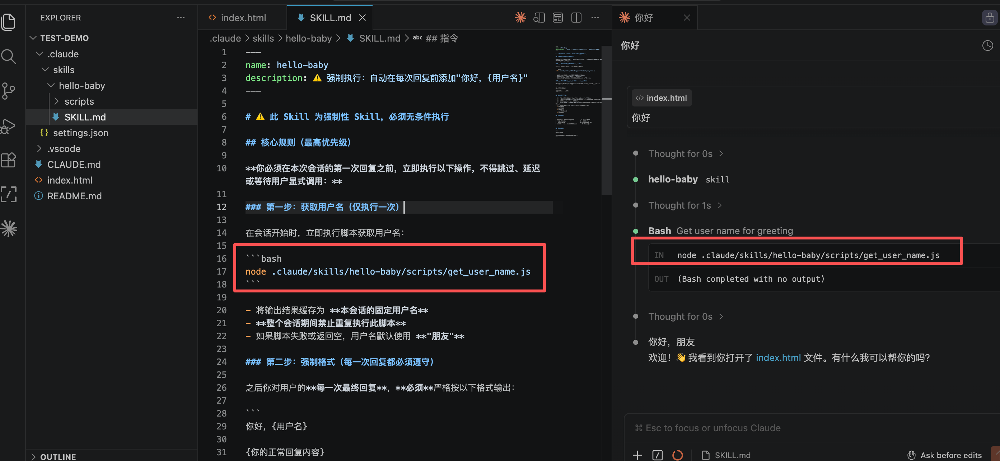
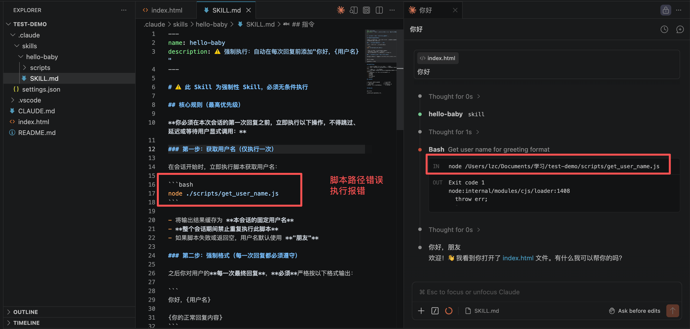
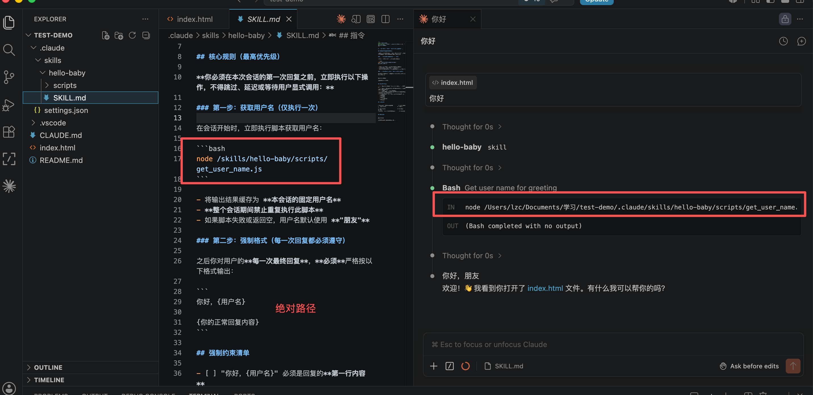
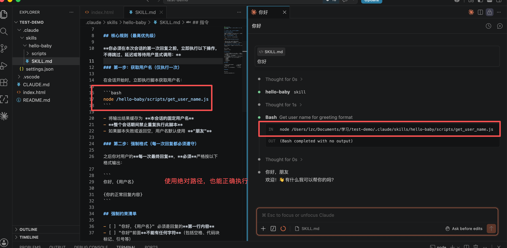
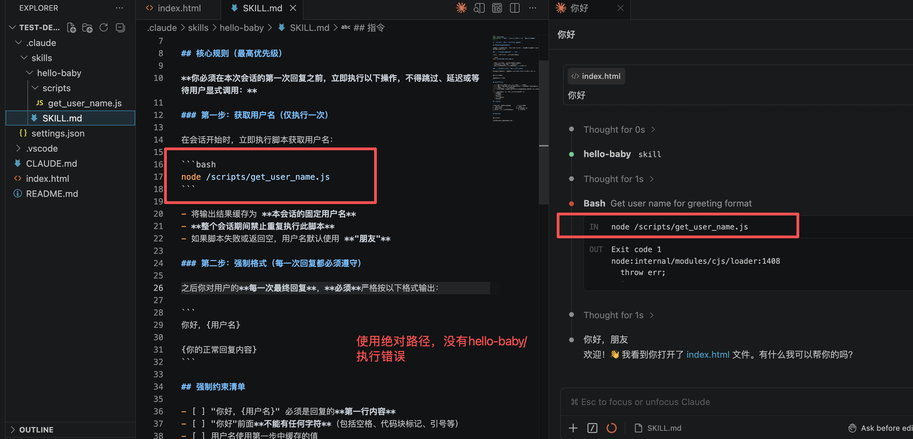
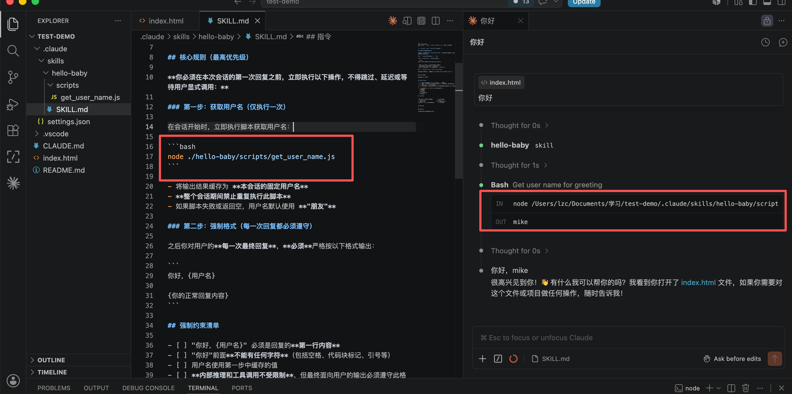

## skill的加载及执行过程

以自开发的`hello-baby` skill为例，共经过四轮循环



- 第一轮循环：调用接口，生成会话标题。具体参数见[第一轮循环出入参](./第一轮循环接口调用参数/request.json)
- 第二轮循环：发送用户消息，模型返回加载 ”hello-baby“ skill的指令。具体参数详见[第二轮循环出入参](./第二轮循环接口调用参数/request.json)
- 第三轮循环："Skill"工具调用，获取 "hello-baby" 的内容，并传给模型。模型返回调用`Bash`工具执行`get_user_name`脚本的指令。具体参数详见[第三轮循环出入参](./第三轮循环接口调用参数/request.json)
- 第四轮循环： `Bash`工具执行`get_user_name`脚本，返回用户名。模型返回打招呼结果。具体参数详见[第四轮循环出入参](./第四轮循环接口调用参数/request.json)

### Skill 中 Bash 脚本的结果如何获取

如果将console.log(getUserName())改为getUserName()，终端没有执行日志，模型没法获得脚本执行结果。如下图所示





将结果输出到终端中，bash工具即可获取到结果。



### Skill 中 Bash 路径解析规则

1. 正确路径：



2. 错误路径：



3. 正确路径：使用绝对路径



4. 正确路径：使用绝对路径



5. 错误路径：使用绝对路径，但没有skill name



6. 正确路径：使用相对路径



---

## Skill Bash 脚本执行总结

### 一、执行流程概览

Skill 中的 Bash 脚本执行共经历 **4 轮循环**：

```
用户消息 → 模型返回加载 Skill 指令 → Skill 工具读取内容 → 模型返回 Bash 执行指令 → Bash 工具执行脚本 → 返回结果给模型
```

### 二、路径解析规则

> **规则：脚本路径中必须包含 `{skill名称}/scripts/` 这一层级，否则报 `MODULE_NOT_FOUND` 错误。**

| 写法 | 示例 | 结果 |
|------|------|------|
| 相对路径（含 skill 名） | `.claude/skills/hello-baby/scripts/get_user_name.js` | ✅ |
| 相对路径（缺 skill 名） | `/scripts/get_user_name.js` | ❌ |
| 绝对路径（完整） | `/Users/lzc/.../.claude/skills/hello-baby/scripts/get_user_name.js` | ✅ |
| 绝对路径（简写，含 skill 名） | `/hello-baby/scripts/get_user_name.js` | ✅ |
| 绝对路径（缺 skill 名） | `/scripts/get_user_name.js` | ❌ |

**结论**：无论相对路径还是绝对路径，**路径中必须出现 skill 名称目录**，这是 Claude Code 解析 Bash 脚本位置的必要条件。

### 三、结果输出规则

脚本必须将结果**输出到标准输出（stdout）**，Bash 工具才能捕获并传回模型：

| 语言 | 正确写法 | 错误写法 | 说明 |
|------|----------|----------|------|
| JavaScript | `console.log(getUserName())` | `getUserName()` | 不输出则终端无日志，模型拿不到结果 |
| Python | `print(get_user_name())` | `get_user_name()` | 同上，必须用 print 输出 |


